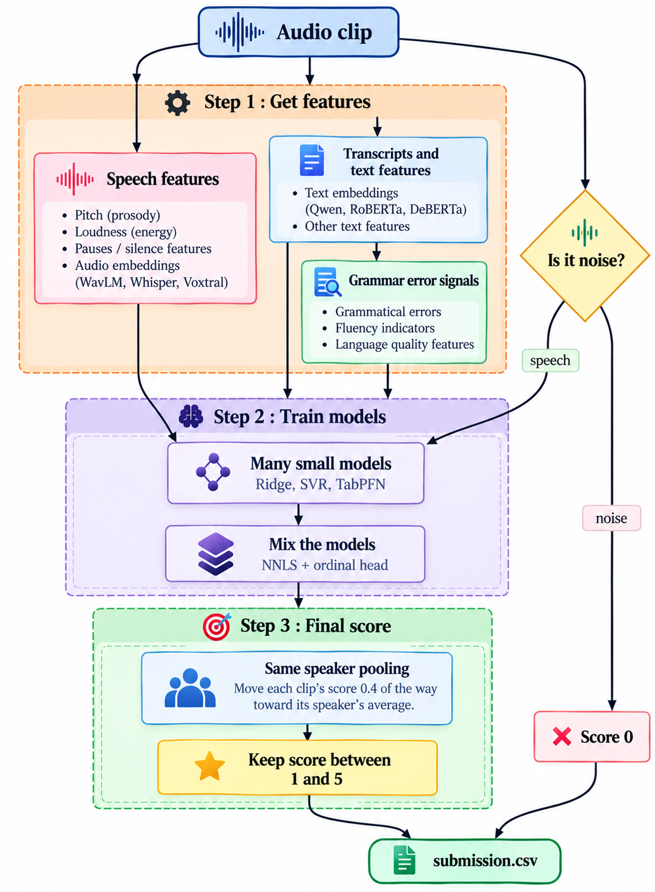

# Grammar Scoring Engine

This is my solution to the SHL Hiring Assessment 2026 Kaggle competition. The task is to predict a 0–5 grammar score for spoken English clips (769 train, 216 test). 
It does not rely on one model. It looks at each clip in many ways, trains many small models, and mixes their answers into one final score.

---

## 🏗️ Architecture


---

## 🔬 How it works

**Step 1 - Get features** (`extract_features.py`)

For every clip we collect:

- **Speech features:** loudness, pauses, pitch, and embeddings from WavLM, Whisper and Voxtral.
- **Transcripts:** the clip is converted to text by Whisper (v2 and v3) and Parakeet. We use more than one so that spoken mistakes are not silently fixed.
- **Text features:** scores and embeddings from Qwen2.5-7B, RoBERTa, ELECTRA and DeBERTa.
- **Grammar signals:** how many edits a grammar corrector wants to make, and how odd the sentences look to a language model.
- **Simple counts:** speaking speed, filler words (um, uh), repeated words, word variety, sentence structure.

**Step 2 - Handle noise**

Silent or noisy clips get grade 0 by a simple rule (high zero-crossing rate and low volume change). All other clips are used to train the models.

**Step 3 - Train many small models**

Each feature set trains its own small model (Ridge, SVR, or TabPFN). Weak models are dropped.

**Step 4 - Validate fairly**

Clips from the same speaker are never split between training and testing. Otherwise the model can learn a person's voice and the score looks better than it really is. We also test on questions the model has not seen before.

**Step 5 - Mix the models**

Two mixers combine the model outputs:

- **NNLS:** finds a positive weight for each model.
- **Ordinal head:** a small network that predicts "is the grade above 1, 2, 3, 4?" and adds these up.

**Step 6 - Final clean-up**

- Clips from the same speaker are nudged toward their speaker's average score.
- Scores are kept between 1 and 5.
- Noise clips are set to 0.

---

## 📁 Files

| File | Purpose |
| --- | --- |
| `extract_features.py` | Creates all features and saves them in `features/` |
| `shl_grammar_scoring.ipynb` | Trains the models, mixes them, writes the submission |
| `features/` | Saved features (created by the script) |
| `submission.csv` | Final predictions |

---

## 🚀 How to run

**1. Install**

```bash
pip install faster-whisper==1.1.1 "nemo_toolkit[asr]" "mistral-common[audio]" spacy sentencepiece tabpfn-client
python -m spacy download en_core_web_sm
```

**2. Create features** (about 8 GPU-hours on 2 T4 GPUs)

```bash
python extract_features.py
```

To run only some steps: `python extract_features.py --steps asr gec`

**3. Train and predict**

Open the notebook, set the data and features paths in the first cell, and run all cells. For TabPFN, add a Kaggle secret named `TABPFN_TOKEN`. Without it, the notebook still runs but skips TabPFN.

---

## 📊 Results

| | RMSE |
|---|---|
| Public leaderboard | **0.3214** |


RMSE is the average error (lower is better). Pearson shows how closely predictions follow the true grades (higher is better). The numbers in the table below come from the notebook's validation, where clips from the same speaker are never split between training and testing.

| Model | RMSE | Pearson |
| --- | --- | --- |
| Best single model (all features + TabPFN) | 0.5156 | 0.8615 |
| Plain average of 72 models | 0.5306 | 0.8627 |
| NNLS mix only | 0.5119 | 0.8632 |
| Ordinal head only | 0.5145 | 0.8621 |
| **Final mix (NNLS + ordinal head, 50/50)** | **0.5085** | **0.8652** |
| Final mix + same-speaker pooling | **0.5039** | - |

**Other checks**

- **Unseen questions:** on questions the model never saw in training, the final mix gets an RMSE of 0.5191 (plain average: 0.5665).
- **By clip length** (final mix, before pooling): 45 s clips 0.520, 60 s clips 0.508, under 44 s 0.514, 44-59 s 0.437.
- **Noise rule:** it caught all 37 noise clips in training (100%). No test clip was flagged.
- **Why speaker-safe validation matters:** one test model scored 0.522 with random splits but 0.606 when speakers were kept apart. Random splits make the score look better than it really is.

**Data size**

| | Clips | Speakers |
| --- | --- | --- |
| Train | 769 (732 graded, 37 noise) | 388 |
| Test | 216 | 182 |

**Test predictions:** average 3.25, lowest 1.94, highest 5.0.

---

