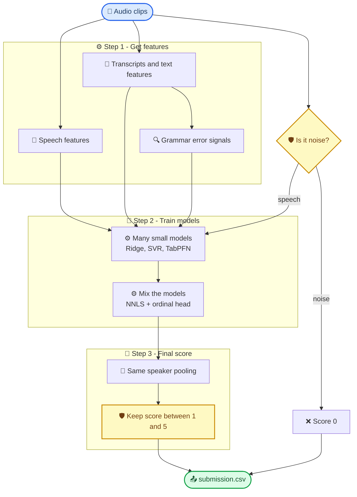

# Grammar Scoring Engine

This project gives a grammar score from 0 to 5 to a short spoken English clip (45-60 seconds).

It does not rely on one model. It looks at each clip in many ways, trains many small models, and mixes their answers into one final score.

---

## 🏗️ Architecture



---

## 🔬 How it works

**Step 1 - Get features** (`extract_features.py`)

For every clip we collect:

- **Speech features:** loudness, pauses, pitch, and embeddings from WavLM, Whisper and Voxtral.
- **Transcripts:** the clip is converted to text by Whisper (v2 and v3) and Parakeet. We use more than one so that spoken mistakes are not silently fixed.
- **Text features:** scores and embeddings from Qwen2.5-7B, RoBERTa, ELECTRA and DeBERTa.
- **Grammar signals:** how many edits a grammar corrector wants to make, and how odd the sentences look to a language model.
- **Simple counts:** speaking speed, filler words (um, uh), repeated words, word variety, sentence structure.

**Step 2 - Handle noise**

Silent or noisy clips get grade 0 by a simple rule (high zero-crossing rate and low volume change). All other clips are used to train the models.

**Step 3 - Train many small models**

Each feature set trains its own small model (Ridge, SVR, or TabPFN). Weak models are dropped.

**Step 4 - Validate fairly**

Clips from the same speaker are never split between training and testing. Otherwise the model can learn a person's voice and the score looks better than it really is. We also test on questions the model has not seen before.

**Step 5 - Mix the models**

Two mixers combine the model outputs:

- **NNLS:** finds a positive weight for each model.
- **Ordinal head:** a small network that predicts "is the grade above 1, 2, 3, 4?" and adds these up.

**Step 6 - Final clean-up**

- Clips from the same speaker are nudged toward their speaker's average score.
- Scores are kept between 1 and 5.
- Noise clips are set to 0.

---

## 📁 Files

| File | Purpose |
| --- | --- |
| `extract_features.py` | Creates all features and saves them in `features/` |
| `shl_grammar_scoring.ipynb` | Trains the models, mixes them, writes the submission |
| `features/` | Saved features (created by the script) |
| `submission.csv` | Final predictions |

---

## 🚀 How to run

**1. Install**

```bash
pip install faster-whisper==1.1.1 "nemo_toolkit[asr]" "mistral-common[audio]" spacy sentencepiece tabpfn-client
python -m spacy download en_core_web_sm
```

**2. Create features** (about 8 GPU-hours on 2 T4 GPUs)

```bash
python extract_features.py
```

To run only some steps: `python extract_features.py --steps asr gec`

**3. Train and predict**

Open the notebook, set the data and features paths in the first cell, and run all cells. For TabPFN, add a Kaggle secret named `TABPFN_TOKEN`. Without it, the notebook still runs but skips TabPFN.

---

## ⚠️ Good to know

- Settings like pruning and mixing weights are chosen on the same validation used for scoring, so the score is slightly optimistic.
- Speaker pooling helps less on the test set because fewer test speakers have more than one clip.
